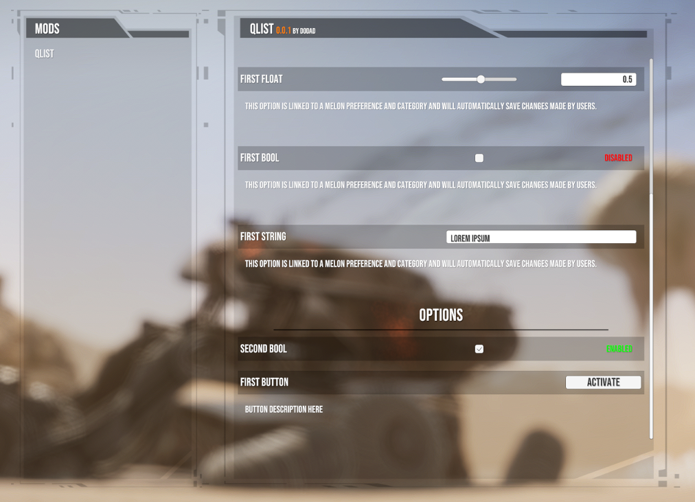

# Description

Easily configure mods for the game Silica through the main menu settings screen or the pause menu

# Instructions - Users

1. Install the mod

2. A new `Mod Options` button will be visible in the main menu settings or the ingame pause menu

3. Mods that have added custom options will appear in the list on the left-hand side. Click a mod name to show available options in the right-hand pane.

# Instructions - Developers

1. Register your mod by calling `QList.Options.RegisterMod(myMelonMod)`

2. Create an option then optionally link it to a Melon Preference or subscribe to `OnValueChangedUntyped`

3. Call `QList.Options.AddOption(myOption)`. Note that any values not provided here will be pulled from the Preference in the Option. Description must be set here or in the preference to appear in the menu.

## Melon Preferences

To link a MelonPreference to an option you only need to pass a `MelonPreferences_Entry` reference to an appropriate option's constructor. Passing a null reference will create a non-persistent option.

On a value change `OnValueChangedUntyped` will be invoked whether a MelonPreference reference exists or not.

## Input Notes

Sliders are supported for IntOption and FloatOption

## Option Types

Option types are located at `QList.OptionTypes`. Currently available:

- IntOption
- FloatOption
- BoolOption
- StringOption
- ButtonOption

# Known Issues

- Slider step value doesn't work

# Special thanks

- databomb for his pioneering efforts in modding Silica
- MelonLoader Discord for support
- The <a href="https://discord.gg/5SHQxFaess">Silica Modders Discord</a>

# Changelog

**0.0.5**

- Options: Added `Action<BaseOption>? OnValueChangedOption`

**0.0.4**

- Fixed ButtonType issues

**0.0.3**

- Fixed OptionType issues

**0.0.2**

- Fixed various UI issues
- Fixed a bug in the game where sometimes the main menu would disappear

**0.0.1**

- First release
